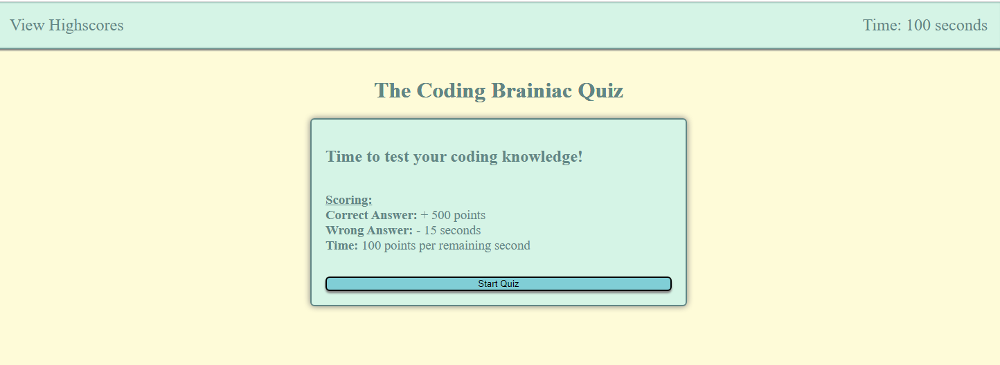

Test your coding knowledge with The Braniac Coding Quiz!

Get through as many multiple choice questions as you can before the time runs out.

Careful! An incorrect answer will remove 15 seconds from the timer!

Recieve 500 points per correct answer and 100 bonus points per second left on the clock if you can get through every question!

When completed, enter your initials to see how you stack up against your past performances and your friends!

Questions order, choice order, and 'incorrect choices' are randomized every time, so no memorizing!

A brief notification will pop up to notify whether you got the previous answer correct.

https://deejerz88.github.io/The-Coding-Brainiac-Quiz

